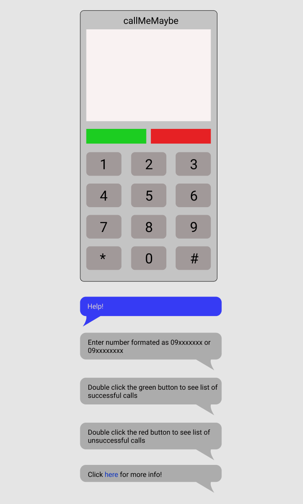

# Call Me Maybe!

An assignment made for aspiring frontend developers.

## Rough sketch

## Required features
- phone section
    - if a user clicks the green button while the numbers are not entered, give out an error message "Please enter phone number"
    - if a user clicks the red button clear cellphone screen
    - if a user clicks a digit on the dialpad that digit is visible on the cellphone screen
        - existing digits are not cleared as new ones are being entered
    - number must be formated as 09xxxxxxx or 09xxxxxxxx to be considered valid
    - if a user clicks the green button the entered number is not in a valid format an error message is displayed on screen "<number entered> is not a valid number"
    - if a user clicks the green button and the entered number is in a valid format a message "Calling <number entered>..." is visible on the cellphone screen
    - if a user swiftly presses the green button two times in a row a list of successful calls is shown on cellphone screen
    - if a user swiftly presses the red button two times in a row a list of unsuccessful calls is shown on cellphone screen
- help section (chat bubbles)
    - when the page opens only the first message ("Help!") is visible
    - when a user clicks "Help!" message other messages are made visible one by one with 2 seconds delay between them being displayed
    - last message links to online git repo

## Notes
- web site must work on both desktop and mobile
    - on desktop whitespace around the cellphone is expected, on mobile not so much
- feel free to choose any web site color pallet you see fit
- provided visual is just a starting point; feel free to make the project more appealing with your selection of colors, custom spacings, type faces, animations, round corners...
